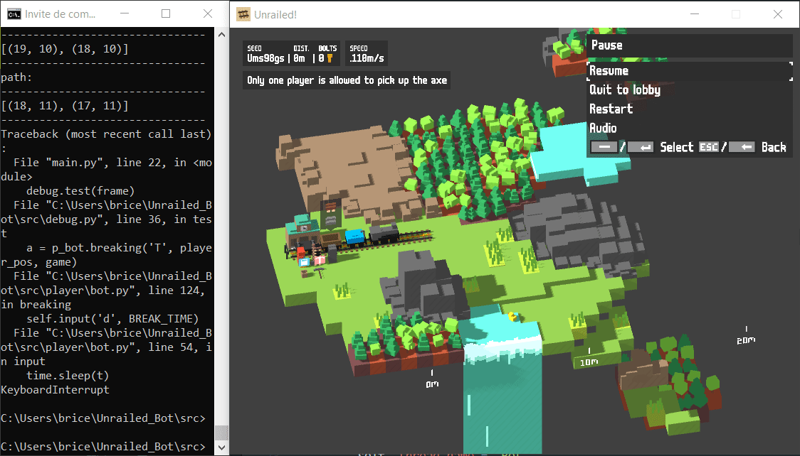
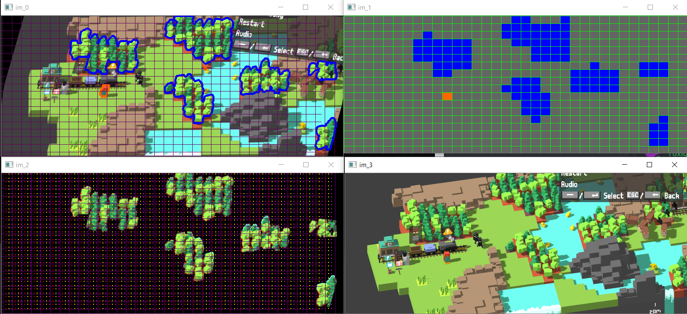

# Unrailed_Bot
## Quick Presentation

Unrailed! is a Video Game available on steam [there](https://unrailed-game.com/) :

I decided to make a bot to play the game with an AI.

+ [Brice PARENT](https://github.com/Naexys)

My friend helped me to clean the repo. Cheers.

+ [Léo BENITO  ](https://github.com/TrAyZeN) 

## Pictures

## Get started

* `launch "Unrailed!"`
* `set the resolution to 800x600 px`
* `set the first player to the orange Penguin with the azerty layout`
* `git clone https://github.com/Naexys/Unrailed_AI.git`
* `cd Unrailed_AI/src`
* `python main.py`

## TO-DO

* add the qwerty layout as an argument in the main.py
* add a pause key to the bot
* add an autoclicker
* handle better errors
* show map each after each movement
* fix axe detection
* clean the repo